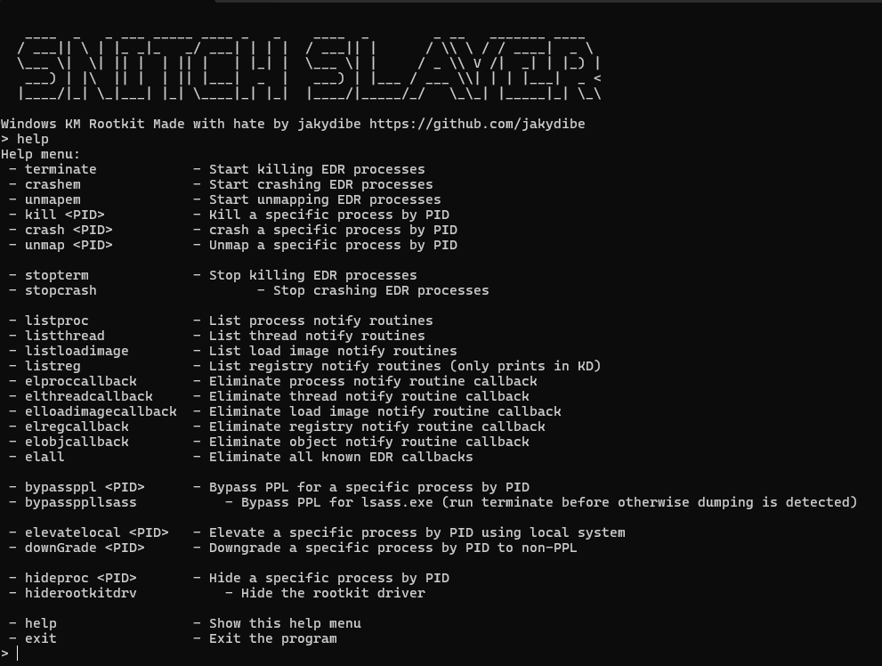

# SnitchSlayer

**SnitchSlayer** is a windows kernel mode rootkit with many functionalities.

Its main objective is making the snitches (Antiviruses/EDRs) shut up or kill them.

## Features

1) Process (and Protected Process) killing by:
    1) Terminating with `ZwTerminateProcess`.
    2) Crashing them by compromising the PEB.
    3) Unmapping them from memory
2) Kernel Callbacks removal.
    1) Removal of process creation kernel callbacks.
    2) Removal of Thread creation kernel callbacks.
    3) Removal of image Loading kernel callbacks.
    4) Removal of Registry operation kernel callbacks.
    5) Removal of Object operations kernel callbacks (BADLY IMPLEMENTED).
    6) Removal of MiniFilter kernel callbacks (NOT IMPLEMENTD).
3) Elevate a User Mode process via Token stealing.
4) Downgrading a process token.
5) PPL bypass via chaning its eprocess structure.
6) Hiding a UserMode process from processes linked list.
7) Hiding kernel driver from drivers linked list.

# Usage

## Temporary

### Starting the Driver
Right now it is not implements as a single executable so the driver needs to be loaded manually.

1) `sc create sh type=Kernel binPath=<path_to_KerSnitch.sys>`
2) `sc start sh`

### Starting the UM Application

1) `.\SnitchHater.exe`
2) `help` to display all functionalities and commands 

## TO:DO

1) Improving Object/Registry kernel callbacks removal.
2) Implementing MiniFilter kernel callbacks removal.
3) ~~Switching to offset finding through PDB files downloaded at runtime.~~
4) Implementing more Function resolving at Runtime (Like ZwTerminateProcess).
5) Implementing Credential Guard bypass for LSASS dump.
6) Disabling kernel Mode ETW providers.
7) Implementing driver loading at runtime from resources instead of manually loading with sc.exe.
8) disabling user mode ETW providers for a process (idk inject a dll on that process or create a remote thread idk).

# Disclaimer

I do not condone abusing this. This is just for research purpose only.

Also is the first time i write windows kernel driver so it may(and for sure has) have many instabilities leading to BSOD so don't use it in ur malware campaign, its useless.

I will not explain how to load an unsigned kernel driver. 

thanks to https://github.com/gmh5225/PDB-EasyPdb/ for the offset resolving with pdb 